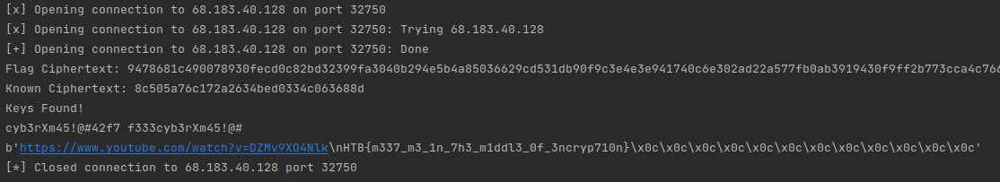

# Crypto :: Meet Me Halfway

*Evil elves have deployed their own cryptographic service. The keys are unknown to everyone but them. Fortunately, their encryption algorithm is vulnerable. Could you help Santa break the encryption and read their secret message?*

### Challenge Files: [crypto_meet_me_halfway.zip](crypto_meet_me_halfway.zip)

For this challenge, you are given a python script *challenge,py* as well as a network service to connect to. When you connect to the service, it prints a message which has been encrypted and asked you to give your own message to be encrypted. A quick glance at the script shows this is expected to be json and hex encoded.


So we have two interesting parts to this challenge, the first is that the keys that are used are generated using a pretty small keyspace:

```python
def gen_key(option=0):
    alphabet = b'0123456789abcdef'
    const = b'cyb3rXm45!@#'
    key = b''
    for i in range(16-len(const)):
        key += bytes([alphabet[randint(0,15)]])

    if option:
        return key + const
    else:
        return const + key
```

This function means that the two keys used are basically just the constant and then two random bytes (or the reverse order). The input is encrypted twice, once with each key and then the final ciphertext is printed out.

So even though the keyspace looks pretty small, if you try to brute force these values by encrypting a known value twice with the possible keys then you end up going through a full 2<sup>32</sup> possible number of keys to find the solution (which will take way too long). However this is where the "meet me halfway" comes into play.

If we take a known value like "A" and encrypt it with every possible "Key 1" and then take the output from the network service and try to decrypt it with every possible "Key 2", then we only need to generate 2 * 0xFFFF = 131070 possible values, which is **much** easier for python to handle. At some point, these values will intercect where encrypt(PT,K1) = decrypt(CT,K2) and both the keys are revealed.

```python
from pwn import *
import json
import binascii
from Crypto.Cipher import AES
from Crypto.Util.Padding import pad

C = remote("68.183.40.128",32750)

C.recvuntil(b"all the elves:\n")
CT1 = C.recvline().decode().strip()
print("Flag Ciphertext: %s" % CT1)
C.recvuntil(b"> ")
C.send(json.dumps({'pt':binascii.hexlify(b"A").decode()}).encode())
CT2 = C.recvline().decode().strip()
print("Known Ciphertext: %s" % CT2)

def encrypt(data, key1, key2):
    cipher = AES.new(key1, mode=AES.MODE_ECB)
    ct = cipher.encrypt(pad(data, 16))
    cipher = AES.new(key2, mode=AES.MODE_ECB)
    ct = cipher.encrypt(ct)
    return ct.hex()

def decrypt(data, key1, key2):
    ct = binascii.unhexlify(data)
    cipher = AES.new(key2.encode(), mode=AES.MODE_ECB)
    pt = cipher.decrypt(ct)
    cipher = AES.new(key1.encode(), mode=AES.MODE_ECB)
    pt = cipher.decrypt(pt)
    return pt

const = 'cyb3rXm45!@#'

R1 = {}

for i in range(0xFFFF):
    K1 = const + '{:04x}'.format(i)
    cipher = AES.new(K1.encode(), mode=AES.MODE_ECB)
    R1[cipher.encrypt(pad(b"A",16)).hex()] = K1

for i in range(0xFFFF):

    K2 = '{:04x}'.format(i) + const
    cipher = AES.new(K2.encode(), mode=AES.MODE_ECB)
    pt = cipher.decrypt(binascii.unhexlify(CT2)).hex()
    if pt in R1:
        print("Keys Found!")
        print(R1[pt],K2)
        print(decrypt(CT1,R1[pt],K2))
        exit()
```



Then we simply need to decrypt the message from the network service with both Key 1 and Key 2 to get back the flag:

```HTB{m337_m3_1n_7h3_m1ddl3_0f_3ncryp710n}```