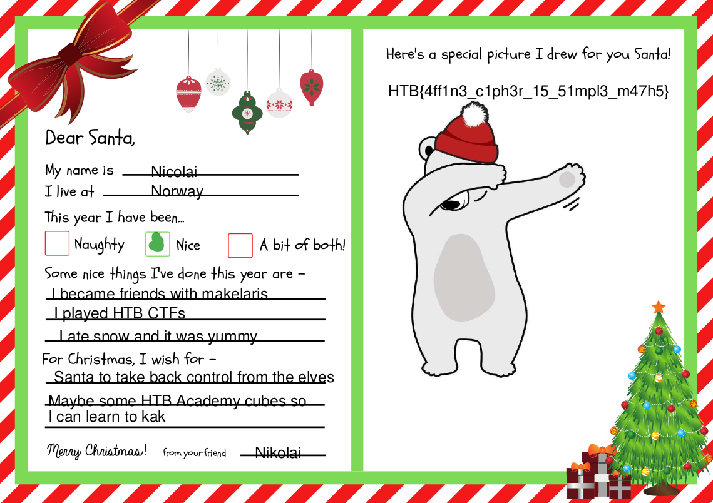

# Crypto :: Xmas Spirit

*Now that elves have taken over Santa has lost so many letters from kids all over the world. However, there is one kid who managed to locate Santa and sent him a letter. It seems like the XMAS spirit is so strong within this kid. He was so smart that thought of encrypting the letter in case elves captured it. Unfortunately, Santa has no idea about cryptography. Can you help him read the letter?*

### Challenge Files: [crypto_xmas_spirit.zip](crypto_xmas_spirit.zip)

For this challenge you are provided *challenge.py* as well as *encrypted.bin*. Examining the python file, we see this encryption function:

```python
def encrypt(dt):
	mod = 256
	while True:
		a = random.randint(1,mod)
		if gcd(a, mod) == 1: break
	b = random.randint(1,mod)

	res = b''
	for byte in dt:
		enc = (a*byte + b) % mod
		res += bytes([enc])
	return res
```

This function generates two random numbers less than 256 and uses them to encrypt each byte of the input file with the formula ```(a*byte + b) % 256``` which is a simple affine cipher.

My solution was just to iterate through the possible values for A and B and look at the header bytes that are output. We know that A cannot share any factors with 256, so that greatly limits the number of values we have to check. I saw ```%PDF``` pop up so I knew it was a PDF file that was encrypted and output the decrypted file.

```python
from math import gcd

with open("encrypted.bin","rb") as F:

    CT = F.read()

    for A in range(256):

        if gcd(A,256) != 1:
            continue

        for B in range(256):

            X = dict([((A*x+B)%256,x) for x in range(256)])

            check = bytearray([X[x] for x in CT[:4]])

            if check == b"%PDF":

                output = bytearray([X[x] for x in CT])

                with open("output.pdf", "wb") as FOut:
                    FOut.write(output)
                    FOut.close()
                    exit()
```




```HTB{4ff1n3_c1ph3r_15_51mpl3_m47h5}```

