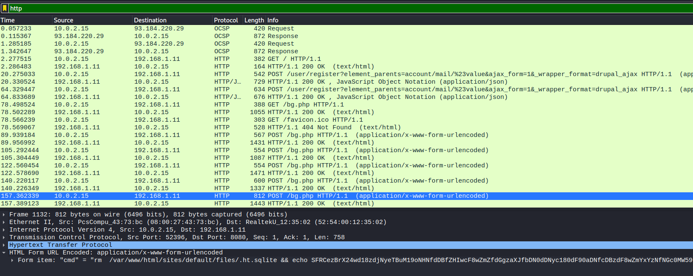

#Forensics :: Baby APT

###Challenge Files: [forensics_baby_apt.zip](forensics_baby_apt.zip)

For this challenge you are provided with a pcap file *christmaswishlist.pcap* which contains some captured traffic. Looking at a first glance you can see that there is some HTTP traffic, which usually means there could be some files being downloaded or uploaded that you can recover.

In this case, we can type "http" in the wireshark filter and click through each of the requests and responses from the server. We see common commands like `whoami` or `cat /etc/passwd` and their corresponding responses, which indicate there is some sort of backdoor shell script running on the server, but then finally we see a command that also includes a base-64 encoded string.



Decoding the string:

```SFRCezBrX24wd18zdjNyeTBuM19oNHNfdDBfZHIwcF8wZmZfdGgzaXJfbDN0dDNyc180dF90aDNfcDBzdF8wZmYxYzNfNGc0MW59```

Reveals the flag:

```HTB{0k_n0w_3v3ry0n3_h4s_t0_dr0p_0ff_th3ir_l3tt3rs_4t_th3_p0st_0ff1c3_4g41n}```