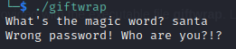
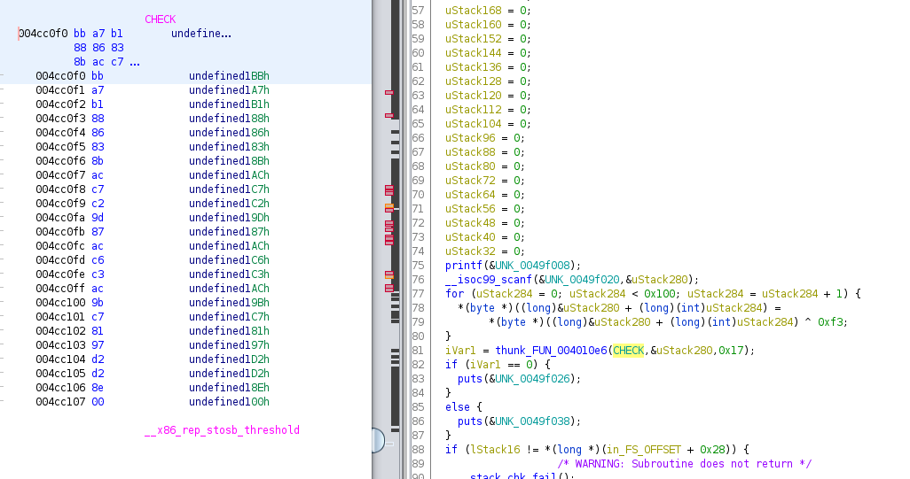

# Reversing :: Gift Wrapping

*The elves won't let you into their secret hideout without the password. Luckily, they've given it to you as a gift! But it seems to be wrapped up tight...*

### Challenge Files: [rev_gift_wrapping.zip](rev_gift_wrapping.zip)

For this challenge we are provided with the executable file **giftwrap**. Looking at it, we are prompted to enter a magic word, which we don't know.



Digging into the file with strings, Ghidra, etc, we aren't really able to find any of those strings in the file. However, we do see *UPX*, which indicates that this is a UPX packed binary file (sort of like gift-wrapping).

We can unpack it by running ```upx -d giftwrap``` which gives us back the unpacked binary which we can actually analyze.

Opening the file in Gghidra, we see in the main function that our input is XORd with the value 0xF3 and then compared with a variable called *CHECK*



So if we punch that into Cyberchef and XOR with 0xF3, we get the flag back:

```HTB{upx_41nt_50_h4rd!!}```

