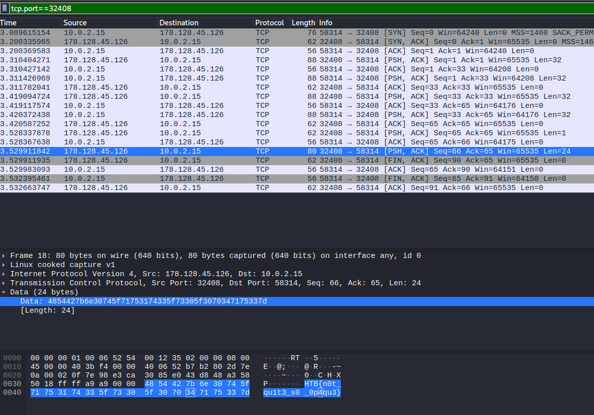

# Reversing :: Infiltration

### Challenge Files: [rev_infiltration.zip](rev_infiltration.zip)

For this challenge, we are provided with an executable, **client** and also a networked service to connect to. Running the program without any input shows:

```
./client [server] [port]
```

So w need to connect the executable to the service we can spin up, which we don't have the source for. After doing that, we see this output:

```
└─$ ./client 178.128.45.126 32408
[!] Untrusted Client Location - Enabling Opaque Mode
```

So let's see what that means....

Opening the executable in Ghidra, we can see that it makes a connection to the remote service and sends and receives some data and then prints the message:

```c
void FUN_001012f0(int param_1)

{
  long in_FS_OFFSET;
  undefined auStack1048 [1032];
  long local_10;
  
  local_10 = *(long *)(in_FS_OFFSET + 0x28);
  recv(param_1,auStack1048,0x400,0);
  puts("[!] Untrusted Client Location - Enabling Opaque Mode");
  if (local_10 == *(long *)(in_FS_OFFSET + 0x28)) {
    return;
  }
                    /* WARNING: Subroutine does not return */
  __stack_chk_fail();
}
```

Using **ltrace** we can see that the program received 24 bytes with recv() before exiting.

```
strtol(0x7fffffffe3b8, 0, 10, 0x7ffff7f9f738)                                         = 0x7e98
inet_pton(2, 0x7fffffffe3a9, 0x7fffffffdf44, 0x7fffffffe3bd)                          = 1
socket(2, 1, 0)                                                                       = 3
connect(3, 0x7fffffffdf40, 16, 0x7ffff7ee00e7)                                        = 0
recv(3, 0x7fffffffdec0, 32, 0)                                                        = 32
send(3, 0x7fffffffdec0, 32, 0)                                                        = 32
recv(3, 0x7fffffffdee0, 32, 0)                                                        = 32
send(3, 0x7fffffffdec0, 32, 0)                                                        = 32
recv(3, 0x7fffffffdec0, 1, 0)                                                         = 1
recv(3, 0x7fffffffdb20, 1024, 0)                                                      = 24
puts("[!] Untrusted Client Location - "...[!] Untrusted Client Location - Enabling Opaque Mode
)                                           = 53
+++ exited (status 0) +++
```

So we have two choices here, we can try to find what it received dynamically with GDB, etc or we can use the method that I chose, which was simply to just listen for the traffic with Wireshark and see what was being sent and received.



After filtering by the port number for the remote service, we can see the flag in plain text being sent to the client program.

```HTB{n0t_qu1t3_s0_0p4qu3}```
