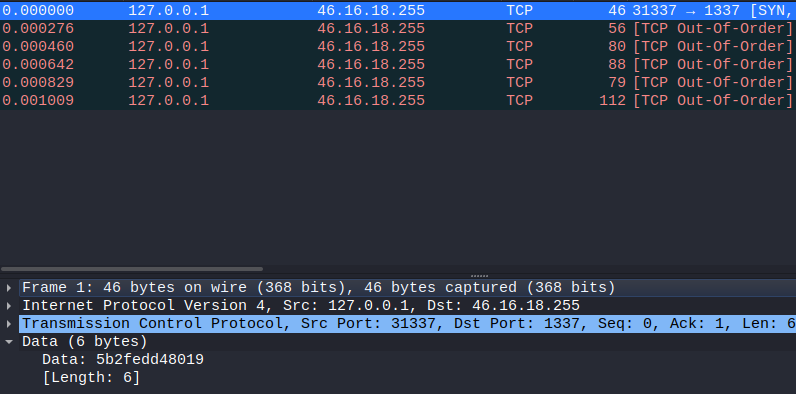

# Reversing :: Intercept

*We managed to covertly spy on some of the elves' communications, as well as obtain partial code for their experimental encryption algorithm. Can you find where they're planning their next meeting?*

### Challenge Files: [rev_intercept.zip](rev_intercept.zip)

For this challenge, we are given a pcap file as well as some assembly code which gives the algorithm used to encrypt the elves' messages.

Looking at the PCAP in Wireshark, we can see some TCP packets which each have some data attached to them.



Next, we look at the ASM file:

```asm
	.text
	.globl	state
	.bss
	.type	state, @object
	.size	state, 1
state:
	.zero	1
	.text
	.globl	do_encrypt
	.type	do_encrypt, @function
do_encrypt:
	push	rbp
	mov	rbp, rsp
	mov	eax, edi
	mov	BYTE PTR [rbp-4], al
	movzx	eax, BYTE PTR state[rip]
	add	eax, 19
	xor	BYTE PTR [rbp-4], al
	movzx	eax, BYTE PTR state[rip]
	add	eax, 55
	mov	BYTE PTR state[rip], al
	movzx	eax, BYTE PTR [rbp-4]
	pop	rbp
	ret
```

If we examine this assembly, it basically boils down to a simple xor cipher with a state that is global and retained every loop and incremented by 55 each time:

```python
import binascii

pack1 = "5b2fedd48019"
pack2 = "14e7eb765119d4fe6223f1d1984638a9"
pack3 = "816b5419dac07b27eed9d35e09fdef65521ac5877a24eed19b0c0ae9f16d4c02cc86773bfaa8924a"
pack4 = "2ae9a12a2f1dd7923d39eea78d5909f9f57b2a16ddc87d33ada58f1208d4f737755283da1168a3e6cc075e8ce920774e"
pack5 = "f88d483fb1bb8a440884af7d69e2c5874b3bb3be695d4fd5a97b27e7d7d0572cf0bf665405dbfe"
pack6 = "4225e19b824813e4b96a4e178a95776fe1d8800b0bf7f0705719c0c37834a8f7a26f1febbe3d7119dad66427d5f58b4259eabc3f3626ded46621d3b0ca441afce552274bd6da1f2a"

data = binascii.unhexlify(pack1+pack2+pack3+pack4+pack5+pack6)

state = 0

output = ""

for d in data:
    output += chr((d ^ (state+19)) % 256)
    state = (state + 55) % 256
print(output)
```

Running this reveals the message:

```
Hello?
Is this working?
Looks like the connection is established
Our next meeting will be at at 90.0000, 135.0000
Make sure to bring the stolen presents!
The password to get in will be HTB{pl41nt3xt_4sm?wh4t_n3xt_s0urc3_c0d3?}
```
