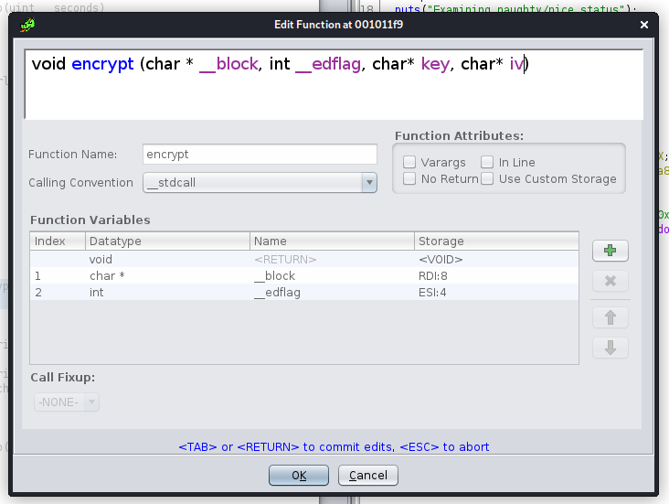

# Reversing :: Upgraded

*The elves have learned from their mistakes, and are now using military grade encryption to protect their secrets! But they've made a critical error...*

### Challenge Files: [rev_upgraded.zip](rev_upgraded.zip)

For this challenge, we are given an executable file, *upgraded*, as well as the output from that program in a text file, *output.txt*

Running the program, we can see that it takes in a string and then encrypts it and gives us the output.


Opening it up in Ghidra, we can see that a function called *encrypt()* is called. And then that function encrypts the text with AES-256-CBC


It's not immediately obvious where the keys are to do this encryption because they don't seem to be loaded anywhere that is immediately apparent. However, if we check the reference for *EVP_EncryptInit_ex* we can see that the final two parameters are indicating that the key and IV will have already been loaded into the RDX and RCX registers.

```int EVP_EncryptInit_ex(EVP_CIPHER_CTX *ctx, const EVP_CIPHER *type,ENGINE *impl, const unsigned char *key, const unsigned char *iv);```


I'm not sure why Ghidra misses the third and fourth parameters for the encrypt function here but you can modify the function signature to include those, if needed.



Clicking on the offsets where the key and IV are being read from, we can simply select the 32 byte key (since this is AES 256) and the 16 byte IV and plug those into Cyberchef with the provided file to get back the flag.


```HTB{h4rdc0d1ng_k3ys?r00k13_m15t4k3!}```