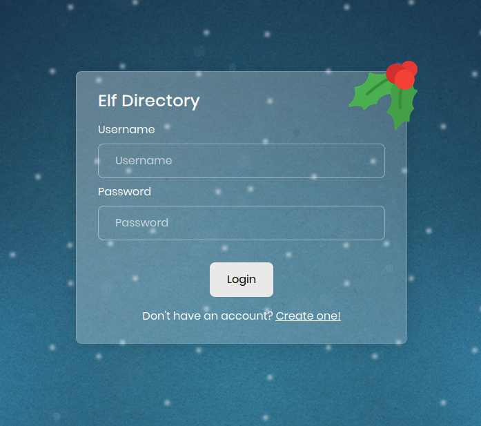
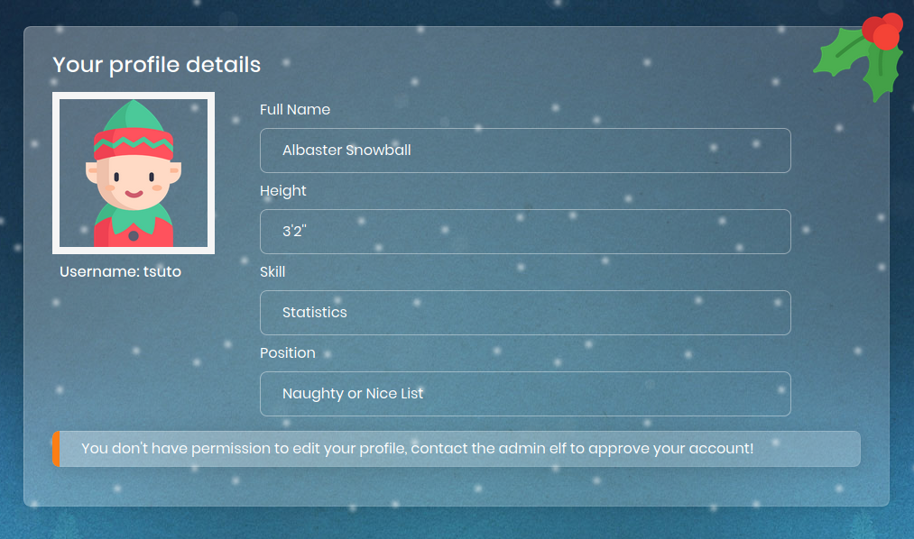
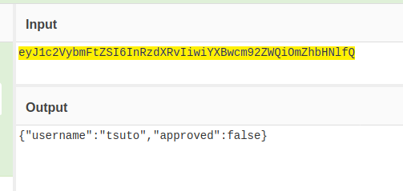
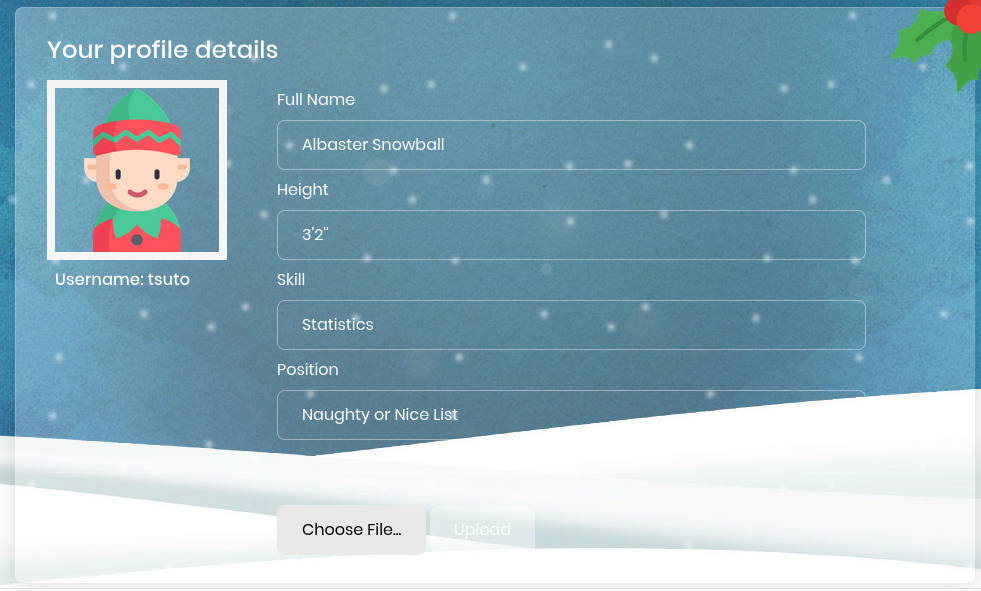
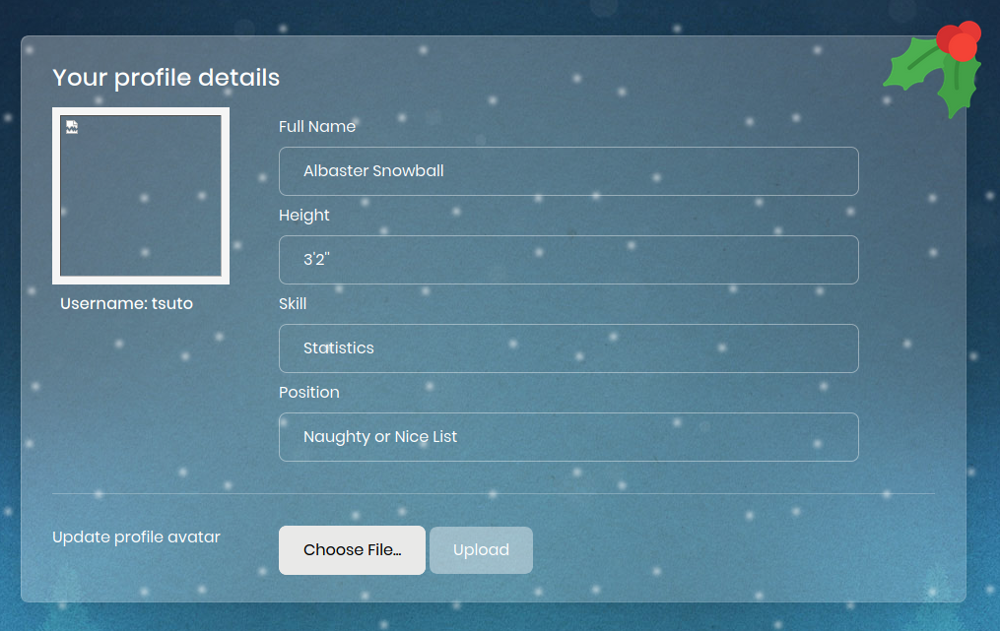
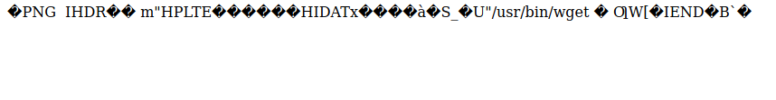
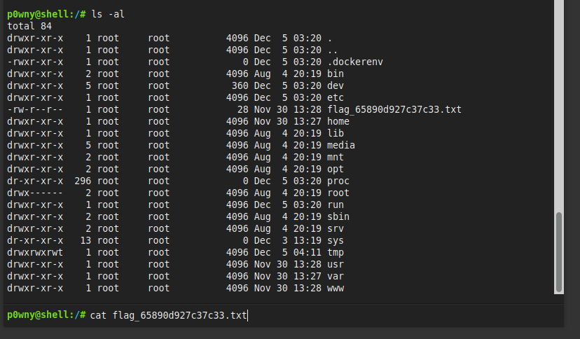

# Web :: Elf Directory

*Can you infiltrate the Elf Directory to get a foothold inside Santa's data warehouse in the North Pole?*

For this challenge, there is a docker component that hosts the vulnerable website, and this time you are NOT provided with any files to examine.

Visiting the site we see a login and registration page for the elf directory.



After creating an account we are prsented with a profile page but do not have any permissions to modify it. Checking our cookies, we see two things: The first is that the cookie is called PHPSESSID which indicates this is a PHP site. The second is that the cookie value is a base64 string.



Decoding the string, we see that it simply has our username and approved = false. SO we can now change that the true, reencode as base 64 and then reload the page.



Now we see that we are able to update our profile photo. Since this is a PHP site, maybe we can trick it into executing PHP code in our profile photo?



I took a 1x1 PNG image and added ```<?php phpinfo(); ?>``` in the middle and sure enough, when I browse to the photo I see the phpinfo page.



So next I'll see if I can get a nice shell script downloaded. I checked with ```which curl```
and nothing showed up, but wget was present on the system. So I changed my code so that it would download a [single file php shell](https://github.com/flozz/p0wny-shell/blob/master/shell.php)




After browsing to shell.php next, I am able to execute any commands that I want on the server. In the root of the server, I can see the flag file and cat it to get the flag.


